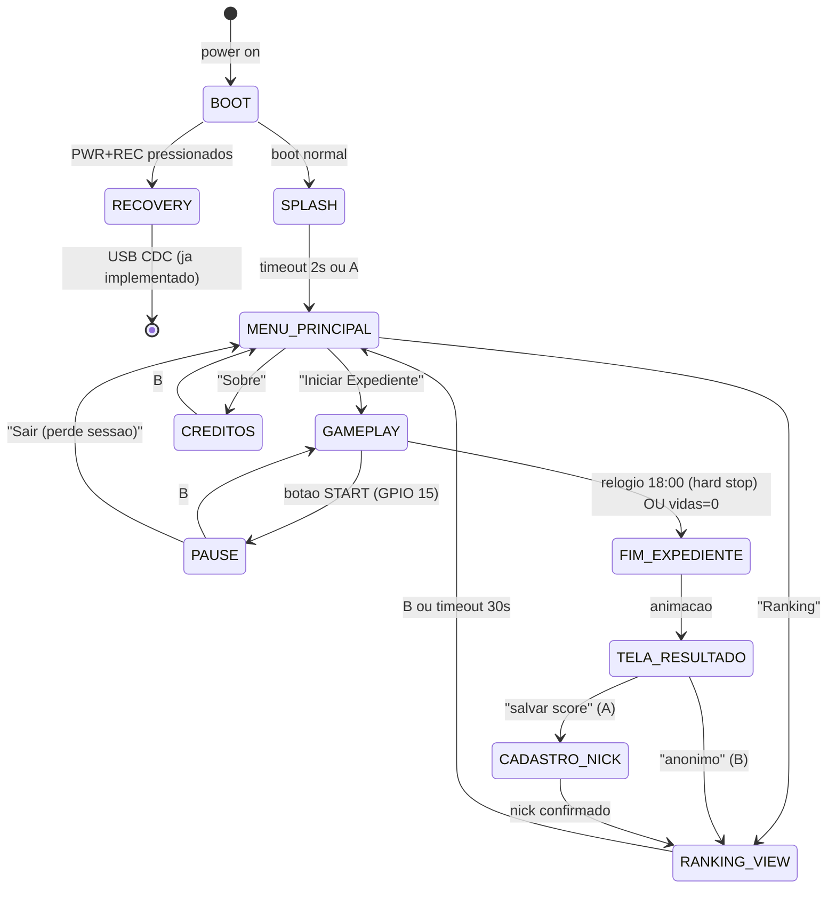
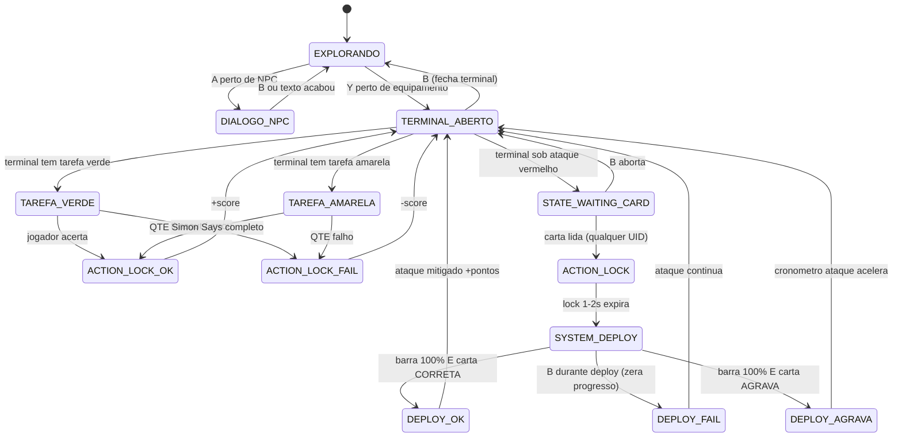
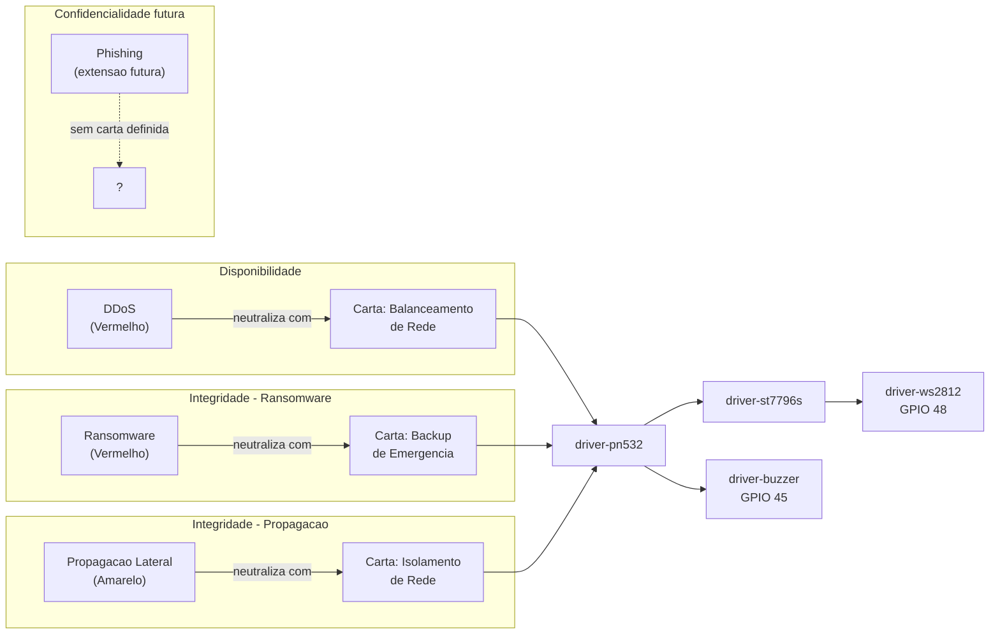
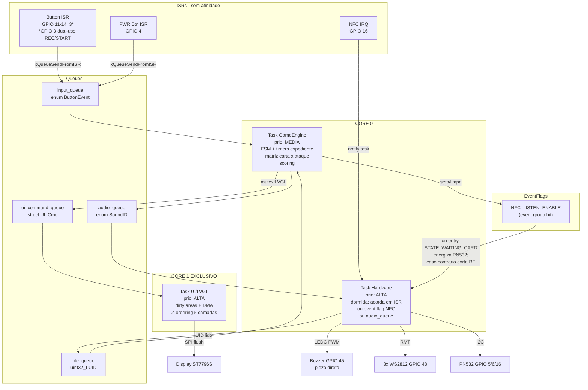
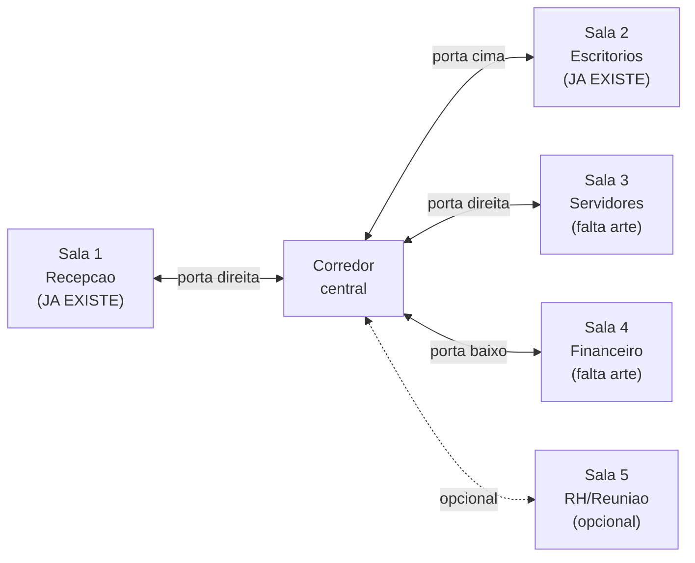
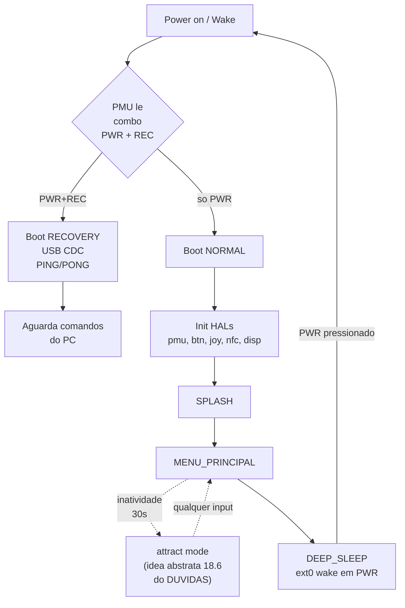
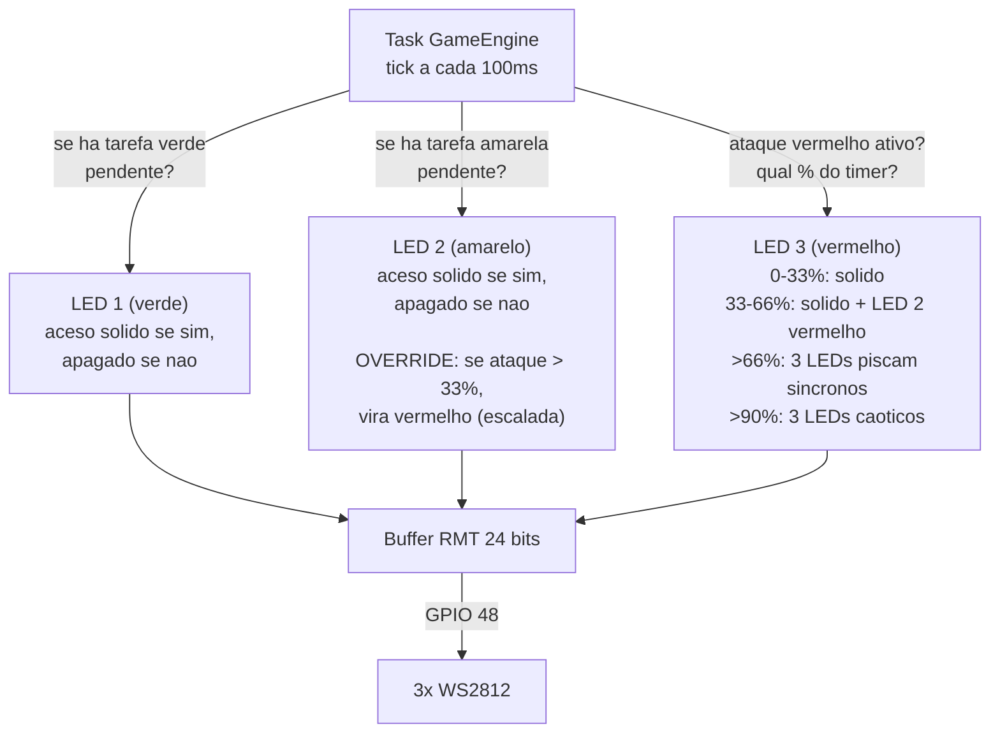
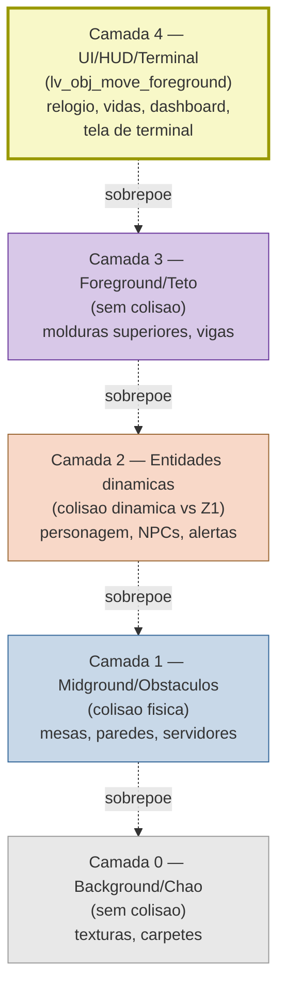

# Diagramas do Projeto CyberSec: Network Defender

> Visao 360 do projeto em Mermaid. Cada secao e um diagrama autocontido.
> Atualizado em 2026-05-12 com as decisoes finais de [[../CONSULTA/RESPOSTAS.txt|RESPOSTAS.txt]].
> Restos em [[../CONSULTA/A resolver.txt|A resolver.txt]].

## 1. FSM macro do jogo (consolidado MVP)

> Maquina de estados finitos de alto nivel. Tutorial dirigido **removido**
> (aprendizagem organica via NPC recepcionista). Calibracao NFC **removida**
> (UIDs hardcoded em `nfc_config.h`). Pause via **START (GPIO 15)**.



## 2. Loop de GAMEPLAY (sub-FSM) — consolidado MVP

> Estados internos do GAMEPLAY. Terminal aberto via **botao Y** quando proximo
> de equipamento interagivel. Toda tarefa exige terminal aberto. B fecha
> terminal (e aborta deploy se em curso).



## 3. Arquitetura de componentes / HALs

> Mapa de dependencias atual (apos commit `db39883`). Setas indicam "depende
> de" / "usa". Componentes em **negrito** ainda nao existem.

```mermaid
graph TD
    main[main.c] --> pmu
    main --> button_hal
    main --> joystick_hal
    main --> nfc_hal
    main --> display_hal
    main --> storage_hal
    main --> ui_debug

    display_hal --> hal_bridge
    hal_bridge --> LVGL["LVGL 9.3<br/>via lv_timer"]
    LVGL --> ui_debug

    storage_hal --> asset_store
    asset_store -.->|Etapa 2: write API<br/>ainda nao existe| asset_store

    pmu -.->|deep sleep<br/>ext0 wake| Hardware

    nfc_hal --> hal_common
    button_hal --> hal_common
    hal_common -->|isr_service_install_once| Hardware

    main --> recovery
    recovery -->|USB CDC<br/>PING/PONG| Hardware

    button_hal -.->|input_queue<br/>(futura)| game_logic
    nfc_hal -.->|nfc_queue<br/>(futura)| game_logic
    joystick_hal -.->|polling<br/>(futura)| game_logic
    asset_store -.->|read API<br/>(futura)| game_logic
    game_logic -.->|ui_cmd_queue<br/>(futura)| hal_bridge
    game_logic -.->|audio_cmd_queue<br/>(futura)| feedback_hal

    game_logic[**game_logic**<br/>EM IMPLEMENTACAO<br/>FSM + tasks + queues<br/>+ nfc_config.h hardcoded]:::wip
    feedback_hal[**feedback_hal**<br/>buzzer + 3x WS2812<br/>EM IMPLEMENTACAO]:::wip

    classDef wip fill:#fff2cc,stroke:#996600,stroke-width:2px,color:#663300
```

## 4. Mapeamento Ataque -> Carta NFC -> HAL

> Versao em grafo da tabela mestre em [[matriz-reacao-ataques]]. Sub-grafos
> agrupam por **pilar CIA** (Confidencialidade / Integridade / Disponibilidade).



## 5. Tasks FreeRTOS + IPC (consolidado MVP — 3 tasks)

> **Atualizado 2026-05-12.** 3 tasks (nao 4 como o artigo) com **core affinity
> obrigatoria**. Audio NAO tem task propria — o GameEngine empurra SoundID na
> audio_queue e a Task Hardware consome (PWM/LEDC nao-bloqueante).



> [!note] Mutex LVGL e cross-core
> Apesar do LVGL rodar em Core 1 exclusivo, a Task GameEngine (Core 0) precisa publicar
> comandos de UI. **O mutex LVGL e a unica forma autorizada** de mexer em objetos LVGL
> de outra task. Toda escrita em arvore LVGL fora do Core 1 deve segurar o mutex (regra
> reforcada em `feedback_lvgl_diff_gating`).

## 6. Topologia de salas (proposta)

> Decisao 3.1 e 3.2 do DUVIDAS.TXT. Esta e uma **proposta minha** baseada nos
> setores citados em [[matriz-reacao-ataques]] (servidores, financeiro,
> recepcao) — confirma com o time antes de produzir os assets.



> [!todo] Decisoes pendentes
> - Numero exato de salas — `S5` e opcional?
> - Topologia: corredor central (proposto aqui), grade 2x2, mapa do predio
>   selecionavel?
> - Cada sala associada a 1 pilar CIA? (Servidores = Disponibilidade,
>   Financeiro = Integridade, Recepcao = Confidencialidade...)

## 7. Lifecycle de boot / power

> Como o sistema decide entre boot normal e recovery mode. Ja implementado
> ate o ponto NORMAL. Recovery completo (commit `9b4a767`).



## 8. Pipeline de assets (proposto)

> Como a arte (Aseprite) vira bytes na NAND e e exibida na tela. Depende da
> Etapa 2 do `asset_store` (write API ainda nao existe).

```mermaid
flowchart LR
    Aseprite[Aseprite<br/>.aseprite] -->|export PNG| PNG[Sprites PNG]
    PNG -->|lvgl-image-converter<br/>OU<br/>script proprio| Bin["Asset binario<br/>RGB565 / indexed"]
    Bin -->|recovery USB CDC<br/>PUT category id| asset_store_write["asset_store<br/>write API<br/>(Etapa 2)"]
    asset_store_write --> NAND[(NAND W25N01GV<br/>128 MB)]
    NAND --> asset_store_read[asset_store<br/>read API<br/>JA EXISTE]
    asset_store_read --> game_logic
    game_logic -->|lv_img_set_src| LVGL
    LVGL --> ST7796[Display ST7796S]
```



## 9. Logica de acionamento dos 3 WS2812

> Decidida em RESPOSTAS.txt — NOTA DE CONSOLIDACAO. **3 LEDs no mesmo barramento
> RMT (GPIO 48)**. LEDs 1 e 2 sao indicadores passivos de tarefas pendentes;
> LED 3 e exclusivo do ataque e arrasta os outros conforme o ataque escala.



## 10. Z-Ordering (5 camadas LVGL)

> Decidido em NOTA DE CONSOLIDACAO. Sem buffers separados — apenas ordem na
> arvore parent/child. HUD/Terminal forcado via `lv_obj_move_foreground()`.



## Referencias cruzadas

- [[matriz-reacao-ataques]] — fonte primaria do mapeamento ataque/carta/HAL
- [[../CONSULTA/DUVIDAS.TXT|DUVIDAS.TXT]] — duvidas que afetam estes diagramas
- [[../CONSULTA/Artigo.pdf]] — fonte pedagogica e tecnica primaria
- Memoria `project_status_hals` (snapshot 2026-05-11) — o que ja esta commitado
- Memoria `project_hardware` — pinout definitivo
