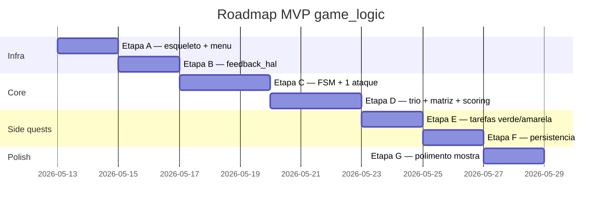

# Plano de Implementacao — `components/game_logic` e `feedback_hal`

> Ordem proposta de implementacao apos ratificacao das decisoes em
> [[../CONSULTA/RESPOSTAS.txt|RESPOSTAS.txt]]. Cada etapa **compila e roda em
> hardware** antes da proxima — sem big-bang. Aprovacao do usuario necessaria
> entre cada etapa.

## Estrutura final de pastas (objetivo)

```
components/
├── hardware/        (ja existe: pmu, button, joystick, nfc, display, storage)
├── hal_common/      (ja existe)
├── hal_bridge/      (ja existe — LVGL bridge)
├── asset_store/    (ja existe — Etapa 1 OK)
├── recovery/       (ja existe — USB CDC PING/PONG OK)
├── feedback_hal/   ⬅ NOVO
│   ├── include/
│   │   └── feedback_hal.h     // contrato: led_state, sound_play
│   ├── feedback_hal.c          // WS2812 (3 LEDs) + buzzer LEDC
│   └── CMakeLists.txt
└── game_logic/     ⬅ NOVO
    ├── include/
    │   ├── game_logic.h        // API publica: game_init, game_start_expediente
    │   ├── game_config.h       // constantes parametrizaveis (intervalos, scores)
    │   ├── nfc_config.h        // UIDs hardcoded das 3 cartas
    │   ├── fsm_states.h        // enum dos estados
    │   └── game_events.h       // structs de eventos (input, nfc, ui_cmd, audio_cmd)
    ├── fsm_core.c              // maquina de estados
    ├── timeline.c              // spawn de eventos por tempo
    ├── scoring.c               // calculo de pontuacao
    ├── attack_matrix.c         // matriz carta x ataque
    ├── game_task.c             // Task GameEngine (FreeRTOS)
    ├── persistence.c           // ranking em NAND via LittleFS
    └── CMakeLists.txt
```

## Etapas em ordem

### Etapa A — Esqueleto + contratos (sem gameplay)

**Objetivo**: o sistema compila e roda; existe uma tela "GAMEPLAY placeholder"
acessivel do menu, mas sem nenhuma logica de jogo.

- Criar `components/game_logic/` com CMakeLists.txt minimo + headers vazios
- Criar `game_config.h` com todas as constantes ratificadas
- Criar `nfc_config.h` com placeholder (3 UIDs zerados — preencher quando
  usuario passar)
- Criar `fsm_states.h` com enum
- Criar `game_task.c` que so loga "GameEngine ticking" e responde a botoes
- Substituir `ui_debug` por um menu simples LVGL (botao "Iniciar") como
  ponto de entrada

**Validacao**: pressionar A no menu acende a tela placeholder; START abre pause;
B volta. Logs de FSM em UART. **Nada na NAND ainda**.

---

### Etapa B — `feedback_hal` (3 WS2812 + buzzer)

**Objetivo**: testar visivel/audivelmente que o hardware secundario funciona,
antes de meter na FSM do jogo.

- `feedback_hal_init()`: inicializa RMT canal para WS2812 (3 LEDs) e LEDC para
  buzzer
- `feedback_hal_set_led(idx, color)`: API simples para o GameEngine
- `feedback_hal_play_sound(SoundID)`: dispara beep PWM curto (50-200 ms,
  nao-bloqueante)
- Adicionar opcao "Teste de Feedback" no menu para validar cada LED + som
  individualmente

**Validacao**: pelo menu, ciclar pelos LEDs (verde/amarelo/vermelho/caos) e
ouvir os 5 SFX previstos (alerta verde / amarelo / vermelho / sucesso / erro).

---

### Etapa C — FSM minima + 1 ataque (Ransomware como prototipo)

**Objetivo**: provar o loop completo de gameplay com 1 unico ataque hardcoded
no comeco do expediente. Pula menu de salas — abre direto na Sala 2.

- `fsm_core.c`: implementar STATE_EXPLORANDO -> STATE_TERMINAL_ABERTO ->
  STATE_WAITING_CARD -> STATE_ACTION_LOCK -> STATE_SYSTEM_DEPLOY -> volta
- `timeline.c`: dispara 1 evento Ransomware em t=10s
- `attack_matrix.c`: implementar a tabela 3x3 (mas so a coluna Ransomware
  por enquanto)
- Mover personagem ate o servidor (joystick + colisao basica retangular)
- Botao Y abre terminal
- PN532 fica desligado durante exploracao; ligado em STATE_WAITING_CARD
- LED 3 acende quando ataque ativo; toca SFX vermelho

**Validacao**: jogar a mecanica de UMA ponta a outra — ataque dispara, jogador
move ate o servidor, abre terminal, encosta carta de Backup, ve a barra de
deploy encher, ve a mensagem de sucesso, ve LEDs apagarem. **Sem score
visivel ainda**.

---

### Etapa D — Trio completo + matriz de agravamento + scoring

- Adicionar DDoS e Propagacao Lateral a timeline
- Implementar a matriz 3x3 inteira (cartas inuteis e cartas que agravam)
- Implementar `scoring.c` com pontuacao por evento + bonus de velocidade
- HUD: relogio do expediente + pontuacao + barra de vidas

**Validacao**: jogar 3 minutos completos, ver score subir, testar carta errada
e ver agravamento.

---

### Etapa E — Tarefas verde e amarela

- Implementar tarefa verde (4 opcoes de senha — default da `A resolver.txt`)
- Implementar tarefa amarela (Simon Says com 4 botoes)
- LEDs 1 e 2 reagem a tarefas pendentes
- Spawn periodico via timeline

**Validacao**: ver tarefas verde/amarela aparecerem, resolver, ver score subir.

---

### Etapa F — Persistencia (ranking em NAND via LittleFS)

- Configurar `esp_littlefs` montando em `/sys` (particao da NAND ja existente
  via `storage_hal`)
- `persistence.c`: ler/escrever arquivo binario `/sys/logs/ranking.bin`
- Tela de cadastro de nick apos vitoria (joystick + A + B)
- Tela de ranking acessivel do menu

**Validacao**: jogar, ganhar, salvar nick, desligar console, ligar de novo, ver
o nick no top do ranking.

---

### Etapa G — Polimento e mostra-ready

- Tela de splash com nome do jogo
- Tela de vitoria/derrota com QR code placeholder
- Timeout idle de 30s na tela final
- Diferenca visual de setor destruido (faixa amarela na porta)
- Audit de logs para tirar verbosity excessiva
- Smoke test completo: 5 partidas seguidas sem reset

**Validacao**: console rodavel em loop continuo para visitantes da mostra,
sem precisar reset manual entre sessoes.

---

## Pontos que vao gerar commits separados

Cada etapa A-G = pelo menos 1 commit (`feat(game_logic): ...`). Etapas
grandes (C, D, E, F) podem ser quebradas em 2-3 commits internos.

## Ordem cronologica vs commits



> [!note] Datas tentativas
> Os dias acima sao chute. Calibrar com a data real da mostra academica.
> A duvida 1.2 do DUVIDAS.TXT pediu essa info mas nao foi respondida —
> registrar em `A resolver.txt` se virar bloqueador.

## Bloqueadores conhecidos

- **B1** — UIDs reais das 3 cartas NFC. Sem eles, nfc_config.h fica com
  placeholder e a Etapa C nao consegue validar carta correta vs errada.
  ACAO: usuario precisa ler as 3 tags fisicas (recovery mode + leitura
  bruta via PN532, ou app celular) e passar os 3 UIDs.

- **B2** — `recovery` precisa expandir PING/PONG para PUT/GET/LIST para
  carregar assets na NAND. Pode ser feito em paralelo com Etapa A-C, mas
  bloqueia G (telas finais com imagens).

- **B3** — Arte de Sala 3 (Servidores), Sala 4 (Financeiro), Sala 5/RH ainda
  nao existe. Sem ela, MVP roda so na Sala 2 (Escritorios). Etapa C pode
  prosseguir com placeholder grafico.
